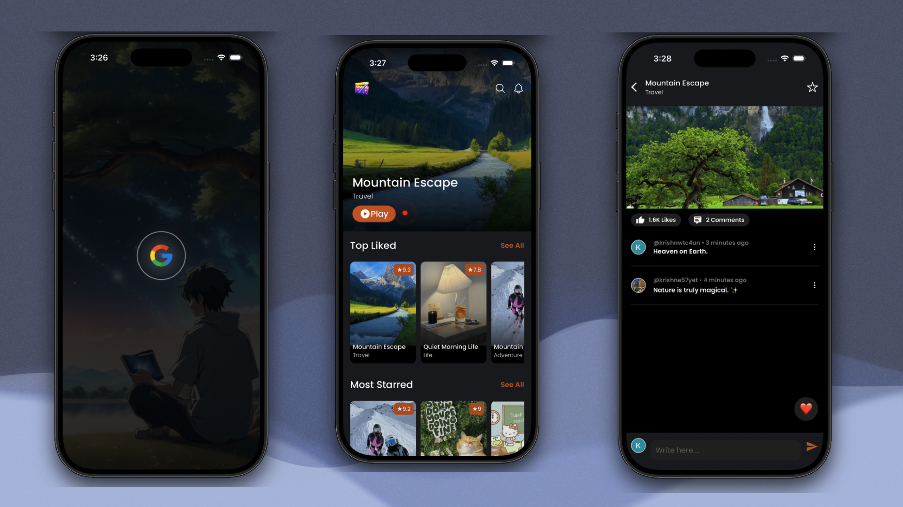

<div align="center">


# PocketPlay

### A modern video-streaming mobile app built with React Native & Expo

<br/>

[](https://reactnative.dev/)
[](https://expo.dev/)
[](https://www.typescriptlang.org/)
[](https://github.com/pmndrs/zustand)
[](https://docs.swmansion.com/react-native-reanimated/)
[](./LICENSE)

<sub>Video Streaming &nbsp;•&nbsp; Real-time Interactions &nbsp;•&nbsp; Animated UI &nbsp;•&nbsp; Modern Architecture</sub>

<br/>

**[Overview](#overview) · [Features](#features) · [Tech Stack](#tech-stack) · [Project Structure](#project-structure) · [Getting Started](#getting-started) · [Screenshots](#screenshots) · [Live Demo](#live-demo) · [Performance](#performance-optimizations) · [License](#license)**

</div>

<br/>

---

## Overview

**PocketPlay** is a production-grade video-streaming application built with **React Native**, **Expo**, and **TypeScript**. It lets users browse videos, watch content, and engage with real-time interactive features — all wrapped in a smooth, native-feeling mobile experience.

The codebase follows a modular, scalable architecture with clear separation between UI, state, services, and types — designed to be easy to extend and maintain.

<br/>

## Features

|     | Feature                   | Description                         |
| :-: | ------------------------- | ----------------------------------- |
| 🎬  | **Video Streaming**       | Powered by `react-native-video`     |
| ⚡  | **Smooth Animations**     | UI-thread driven via Reanimated     |
| 📱  | **Responsive UI**         | Fully mobile-first design           |
| 🧭  | **File-based Navigation** | Built with Expo Router              |
| 💾  | **Persistent Storage**    | Blazing-fast reads/writes with MMKV |
| 🔄  | **API Layer**             | Robust networking built on Axios    |
| 💬  | **Real-time Updates**     | Live sync via Socket.IO             |
| 📦  | **Modular Architecture**  | Reusable, composable components     |
| 🔐  | **Secure Auth**           | Google Sign-In (OAuth 2.0)          |
| 🧩  | **Typed Codebase**        | Centralized TypeScript definitions  |

<br/>

## Tech Stack

<div align="center">

| Category                  | Technology                                                           |
| ------------------------- | -------------------------------------------------------------------- |
| **Mobile Framework**      | React Native 0.83 · Expo SDK 55 · TypeScript 5.9                     |
| **Navigation**            | Expo Router · React Navigation                                       |
| **State Management**      | Zustand 5.0                                                          |
| **Animations & Gestures** | Reanimated 4 · Gesture Handler                                       |
| **Storage**               | React Native MMKV                                                    |
| **Networking**            | Axios · Socket.IO Client                                             |
| **Media**                 | React Native Video                                                   |
| **Authentication**        | Google Sign-In (OAuth 2.0)                                           |
| **UI Extras**             | Expo Image · Expo Linear Gradient · Expo Glass Effect · Expo Haptics |
| **Native Bindings**       | Nitro Modules                                                        |

</div>

<br/>

## Project Structure

```text
PocketPlay
│
├── src
│   ├── app                        # Expo Router screens
│   │   ├── _layout.tsx
│   │   ├── index.tsx
│   │   ├── home.tsx
│   │   ├── auth.tsx
│   │   └── playlist.tsx
│   │
│   ├── components
│   │   ├── auth
│   │   ├── cards
│   │   ├── home
│   │   ├── playlist
│   │   └── ui
│   │
│   ├── context                    # React Context providers
│   │   └── WSContext.tsx
│   │
│   ├── service                    # API services
│   │   ├── config.ts
│   │   ├── authService.ts
│   │   ├── apiInterceptors.ts
│   │   └── storage.ts
│   │
│   ├── store                      # Zustand state
│   │   ├── authStore.ts
│   │   └── playStore.ts
│   │
│   ├── types                      # Shared TypeScript types & interfaces
│   ├── styles
│   ├── utils
│   ├── assets
│   │   └── images
│   │       ├── icon.png
│   │       └── app.png
│   └── def.d.ts
│
├── .env
├── package.json
├── tsconfig.json
└── README.md
```

<br/>

## Getting Started

### Prerequisites

Make sure you have the following installed before you begin:

- [Node.js](https://nodejs.org/) `>= 18`
- [Expo CLI](https://docs.expo.dev/get-started/installation/) — bundled via `npx expo`, no global install required
- [Android Studio](https://developer.android.com/studio) — for the Android emulator
- [Xcode](https://developer.apple.com/xcode/) — for the iOS simulator (macOS only)

### Installation

```bash
# 1. Clone the repository
git clone https://github.com/krishnakmr08/react-native-pocketplay.git

# 2. Navigate into the project directory
cd react-native-pocketplay

# 3. Install dependencies
npm install
```

### Environment Setup

Create a `.env` file in the project root with the following variables:

```env
EXPO_PUBLIC_IOS_CLIENT_ID=your_ios_client_id
EXPO_PUBLIC_WEB_CLIENT_ID=your_web_client_id
```

### Running the App

```bash
# Start the Expo development server
npm start

# Run on Android emulator/device
npm run android

# Run on iOS simulator (macOS only)
npm run ios

# Run in the browser
npm run web
```

<br/>

## Screenshots

<p align="center">
  
</p>

<br/>

## Live Demo

<div align="center">

[](https://www.youtube.com/watch?v=ZN0mpLm5rjI)

<sub>Click the thumbnail above to watch the full demo on YouTube</sub>

</div>

<br/>

## Performance Optimizations

- **MMKV Storage** — significantly faster reads/writes than `AsyncStorage`
- **Reanimated Worklets** — animations run on the UI thread, avoiding JS bridge overhead
- **Zustand** — lightweight global state management with minimal re-renders
- **Nitro Modules** — native-speed module bindings for performance-critical paths

<br/>

## License

This project is licensed under the **MIT License** — see the [LICENSE](./LICENSE) file for details.

<br/>

## Author

<div align="center">

**Krishna Kumar**
<br/>
<sub>React Native Developer — TypeScript · Expo · Reanimated · Node.js</sub>

<br/><br/>

[](https://github.com/krishnakmr08)

</div>
